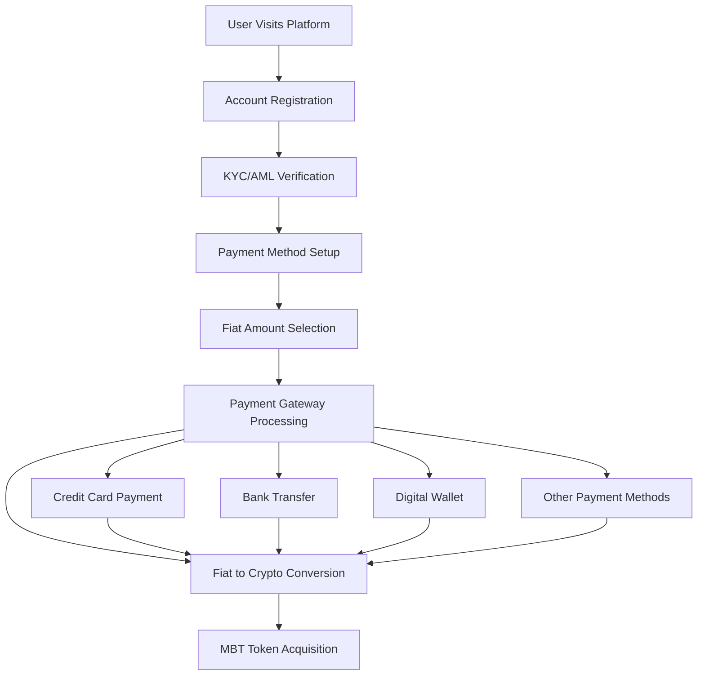
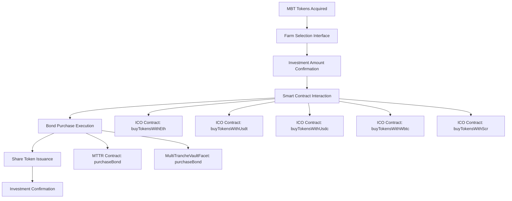
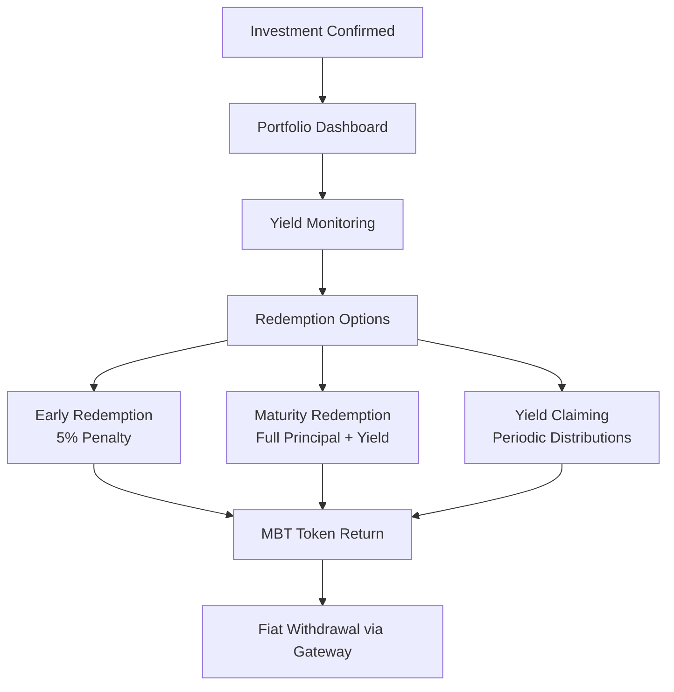
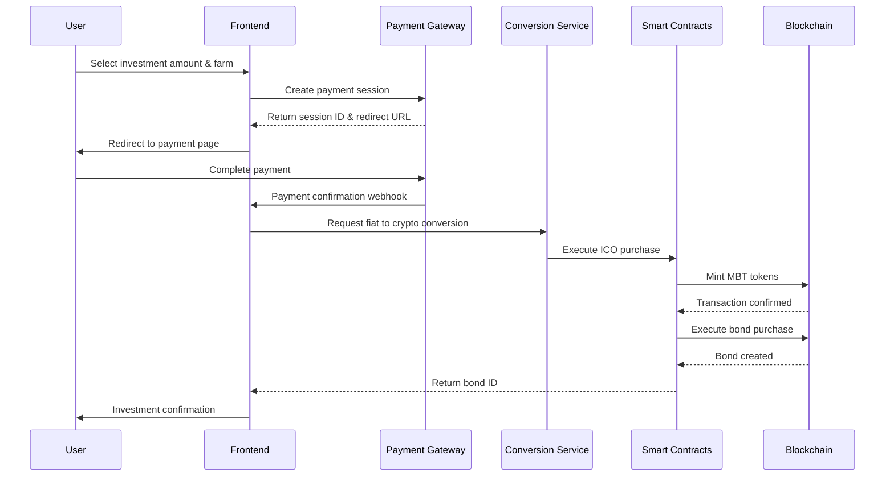

# Fiat Currency Payment Gateway Integration Guide

## Overview

This document outlines the integration of fiat currency payment gateways into the Mocha Coffee ecosystem, enabling traditional investors to seamlessly purchase coffee farm bonds using fiat currency. The system bridges the gap between traditional finance and DeFi by providing a smooth onboarding experience for fiat users.

## System Architecture

The fiat payment gateway integration creates a unified flow that allows users to:
1. **Purchase MBT tokens** using fiat currency through payment gateways
2. **Automatically invest in coffee farm bonds** using the acquired MBT tokens
3. **Manage their investment portfolio** through a user-friendly interface

## Complete User Journey Flow

### Phase 1: User Onboarding and Fiat Payment



### Phase 2: Smart Contract Integration



### Phase 3: Investment Management



## Detailed Integration Points

### 1. Payment Gateway Integration

#### Supported Payment Methods
- **Credit/Debit Cards**: Visa, Mastercard, American Express
- **Bank Transfers**: ACH, Wire transfers, SEPA
- **Digital Wallets**: PayPal, Apple Pay, Google Pay
- **Alternative Payments**: Buy now, pay later options

#### Payment Gateway APIs Required
```javascript
// Example payment gateway integration
const paymentGateway = {
  // Initialize payment session
  createPaymentSession: (amount, currency, userInfo) => {
    // Returns payment session ID and redirect URL
  },
  
  // Process payment
  processPayment: (sessionId, paymentMethod) => {
    // Handles actual payment processing
  },
  
  // Verify payment status
  verifyPayment: (transactionId) => {
    // Confirms payment completion
  },
  
  // Handle refunds
  processRefund: (transactionId, amount) => {
    // Processes refund requests
  }
}
```

### 2. Smart Contract Interaction Points

#### ICO Contract Integration
The ICO contract provides multiple entry points for different payment assets:

```solidity
// Primary functions for fiat gateway integration
contract ICO {
    // ETH-based purchases (for converted ETH from fiat)
    function buyTokensWithEth(address _beneficiary, uint256 _minTokensExpected) 
        public payable nonReentrant whenNotPaused;
    
    // Stablecoin purchases (for converted USDT/USDC from fiat)
    function buyTokensWithUsdt(uint256 _amount, uint256 _minTokensExpected) 
        public nonReentrant whenNotPaused;
    
    function buyTokensWithUsdc(uint256 _amount, uint256 _minTokensExpected) 
        public nonReentrant whenNotPaused;
    
    // Preview functions for user experience
    function previewTokenPurchase(string calldata _paymentMethod, uint256 _amount) 
        external view returns (uint256 tokensToReceive, uint256 usdValue);
}
```

#### Bond Purchase Integration
The MTTR contract handles bond purchases using MBT tokens:

```solidity
// Bond purchase function
contract MochaTreeRightsToken {
    function purchaseBond(uint256 mbtAmount) 
        external nonReentrant whenNotPaused returns (uint256 bondId);
}

// Alternative through Diamond pattern
contract MultiTrancheVaultFacet {
    function purchaseBond(uint256 farmId, uint256 mbtAmount) 
        external returns (uint256 bondId);
}
```

### 3. Unified User Experience Flow

#### Frontend Integration Requirements

```javascript
// Unified investment flow
class FiatInvestmentFlow {
  async initiateInvestment(userData, investmentAmount, farmSelection) {
    // Step 1: Create payment session
    const paymentSession = await this.createPaymentSession(
      investmentAmount, 
      userData.currency,
      userData
    );
    
    // Step 2: Process payment
    const paymentResult = await this.processPayment(
      paymentSession.id,
      userData.paymentMethod
    );
    
    // Step 3: Convert fiat to crypto
    const cryptoAmount = await this.convertFiatToCrypto(
      paymentResult.amount,
      paymentResult.currency
    );
    
    // Step 4: Purchase MBT tokens
    const mbtTokens = await this.purchaseMBTTokens(
      cryptoAmount,
      userData.walletAddress
    );
    
    // Step 5: Purchase bonds
    const bondId = await this.purchaseBonds(
      mbtTokens,
      farmSelection,
      userData.walletAddress
    );
    
    return {
      paymentId: paymentResult.id,
      mbtTokens,
      bondId,
      transactionHash: bondId.txHash
    };
  }
}
```

## Technical Implementation Details

### 1. Payment Processing Architecture



### 2. Error Handling and Rollback

```javascript
// Comprehensive error handling
class InvestmentErrorHandler {
  async handlePaymentFailure(paymentSessionId, error) {
    // Log error for analysis
    await this.logError('payment_failure', {
      sessionId: paymentSessionId,
      error: error.message,
      timestamp: new Date()
    });
    
    // Notify user
    await this.notifyUser(paymentSessionId, {
      type: 'payment_failed',
      message: 'Payment could not be processed. Please try again.'
    });
    
    // Clean up any partial transactions
    await this.cleanupPartialTransactions(paymentSessionId);
  }
  
  async handleSmartContractFailure(transactionHash, error) {
    // Attempt to refund if payment succeeded but contract failed
    if (await this.isPaymentSuccessful(transactionHash)) {
      await this.initiateRefund(transactionHash);
    }
    
    // Notify user of failure
    await this.notifyUser(transactionHash, {
      type: 'contract_failure',
      message: 'Investment could not be completed. Refund initiated.'
    });
  }
}
```

### 3. Security Considerations

#### Multi-Signature Requirements
- Payment gateway transactions require multiple approvals
- Smart contract interactions use time-locked multi-sig
- Emergency pause functionality for all contracts

#### Compliance Integration
- KYC/AML verification before payment processing
- Transaction monitoring for suspicious activity
- Regulatory reporting for large transactions
- Tax reporting integration

#### Risk Management
- Daily transaction limits per user
- Geographic restrictions based on regulations
- Payment method validation and verification
- Fraud detection and prevention

## User Experience Design

### 1. Simplified Onboarding Flow

```
STEP 1: Account Setup
┌─────────────────────────────────────────────────────────────┐
│ Welcome to Mocha Coffee Investments                        │
│                                                             │
│ [ ] I agree to Terms of Service                            │
│ [ ] I agree to Privacy Policy                              │
│ [ ] I confirm I'm not a US person (if applicable)         │
│                                                             │
│ [Continue]                                                  │
└─────────────────────────────────────────────────────────────┘

STEP 2: Identity Verification
┌─────────────────────────────────────────────────────────────┐
│ Verify Your Identity                                        │
│                                                             │
│ Upload Government ID: [Choose File]                        │
│ Take Selfie: [Start Camera]                                │
│ Proof of Address: [Choose File]                            │
│                                                             │
│ [Submit Verification]                                       │
└─────────────────────────────────────────────────────────────┘

STEP 3: Investment Selection
┌─────────────────────────────────────────────────────────────┐
│ Choose Your Investment                                      │
│                                                             │
│ Farm: [Colombian Highlands Farm ▼]                         │
│ Amount: $[1000] USD                                         │
│ Expected APY: 12-15%                                        │
│ Maturity: 36 months                                         │
│                                                             │
│ [Review Investment]                                         │
└─────────────────────────────────────────────────────────────┘
```

### 2. Payment Processing Interface

```
STEP 4: Payment Method
┌─────────────────────────────────────────────────────────────┐
│ Complete Your Investment                                    │
│                                                             │
│ Investment Amount: $1,000.00 USD                           │
│ MBT Tokens to Receive: ~40 MBT                             │
│                                                             │
│ Payment Method:                                             │
│ ○ Credit Card (Visa, Mastercard, Amex)                     │
│ ○ Bank Transfer (ACH)                                      │
│ ○ PayPal                                                    │
│ ○ Apple Pay                                                 │
│                                                             │
│ [Process Payment]                                           │
└─────────────────────────────────────────────────────────────┘
```

### 3. Investment Confirmation

```
STEP 5: Confirmation
┌─────────────────────────────────────────────────────────────┐
│ Investment Successful!                                      │
│                                                             │
│ ✅ Payment Processed: $1,000.00 USD                        │
│ ✅ MBT Tokens Acquired: 40.25 MBT                          │
│ ✅ Bond Purchased: #12345                                   │
│ ✅ Farm: Colombian Highlands Farm                           │
│ ✅ Maturity Date: March 15, 2027                           │
│                                                             │
│ Transaction Hash: 0x1234...5678                            │
│                                                             │
│ [View Portfolio] [Download Receipt]                        │
└─────────────────────────────────────────────────────────────┘
```

## API Specifications

### 1. Payment Gateway API

```typescript
interface PaymentGatewayAPI {
  // Create payment session
  createSession(request: CreateSessionRequest): Promise<CreateSessionResponse>;
  
  // Process payment
  processPayment(request: ProcessPaymentRequest): Promise<ProcessPaymentResponse>;
  
  // Verify payment status
  verifyPayment(transactionId: string): Promise<PaymentStatus>;
  
  // Handle refunds
  processRefund(request: RefundRequest): Promise<RefundResponse>;
}

interface CreateSessionRequest {
  amount: number;
  currency: string;
  userId: string;
  returnUrl: string;
  metadata: {
    farmId: string;
    investmentType: string;
  };
}

interface ProcessPaymentRequest {
  sessionId: string;
  paymentMethod: PaymentMethod;
  userInfo: UserInfo;
}
```

### 2. Smart Contract Integration API

```typescript
interface SmartContractAPI {
  // ICO functions
  previewTokenPurchase(paymentMethod: string, amount: bigint): Promise<TokenPreview>;
  buyTokensWithEth(beneficiary: string, minTokens: bigint): Promise<TransactionResult>;
  buyTokensWithUsdt(amount: bigint, minTokens: bigint): Promise<TransactionResult>;
  
  // Bond purchase functions
  purchaseBond(mbtAmount: bigint): Promise<BondPurchaseResult>;
  getBondDetails(bondId: string): Promise<BondDetails>;
  
  // Portfolio management
  getUserBonds(userAddress: string): Promise<BondPosition[]>;
  redeemBond(bondId: string): Promise<RedemptionResult>;
}
```

## Monitoring and Analytics

### 1. Key Performance Indicators (KPIs)

- **Conversion Rate**: Fiat payment to successful bond purchase
- **Payment Success Rate**: Percentage of successful payments
- **User Drop-off Points**: Where users abandon the flow
- **Average Investment Amount**: Per user and per transaction
- **Geographic Distribution**: Investment patterns by region

### 2. Real-time Monitoring

```javascript
// Real-time monitoring dashboard
class InvestmentMonitoring {
  async trackUserJourney(userId, step, data) {
    await this.analytics.track('user_journey', {
      userId,
      step,
      timestamp: new Date(),
      data
    });
  }
  
  async monitorPaymentSuccess(paymentId, success) {
    await this.metrics.increment('payment_success_rate', {
      success: success ? 1 : 0,
      paymentId
    });
  }
  
  async alertOnAnomalies(metric, threshold) {
    if (metric > threshold) {
      await this.notifications.sendAlert({
        type: 'anomaly_detected',
        metric,
        threshold,
        timestamp: new Date()
      });
    }
  }
}
```

## Compliance and Regulatory Considerations

### 1. Regulatory Requirements

- **KYC/AML Compliance**: Full identity verification before investment
- **Geographic Restrictions**: Compliance with local investment regulations
- **Transaction Reporting**: Automated reporting for regulatory bodies
- **Tax Documentation**: Generation of tax documents for users

### 2. Data Protection

- **GDPR Compliance**: European data protection standards
- **Data Encryption**: End-to-end encryption for sensitive data
- **Secure Storage**: Encrypted storage of user information
- **Right to Deletion**: User data deletion capabilities

## Conclusion

The fiat currency payment gateway integration provides a seamless bridge between traditional finance and DeFi, enabling mainstream adoption of coffee farm bond investments. The system maintains security, compliance, and user experience while providing the technical infrastructure needed for scalable growth.

Key benefits of this integration:
- **Accessibility**: Traditional investors can participate without crypto knowledge
- **Security**: Multi-layered security with compliance integration
- **Scalability**: Designed to handle high transaction volumes
- **User Experience**: Simplified, intuitive investment process
- **Transparency**: Full transaction visibility and reporting

This integration positions Mocha Coffee as a leader in bringing real-world assets to the blockchain while maintaining the highest standards of user experience and regulatory compliance.
