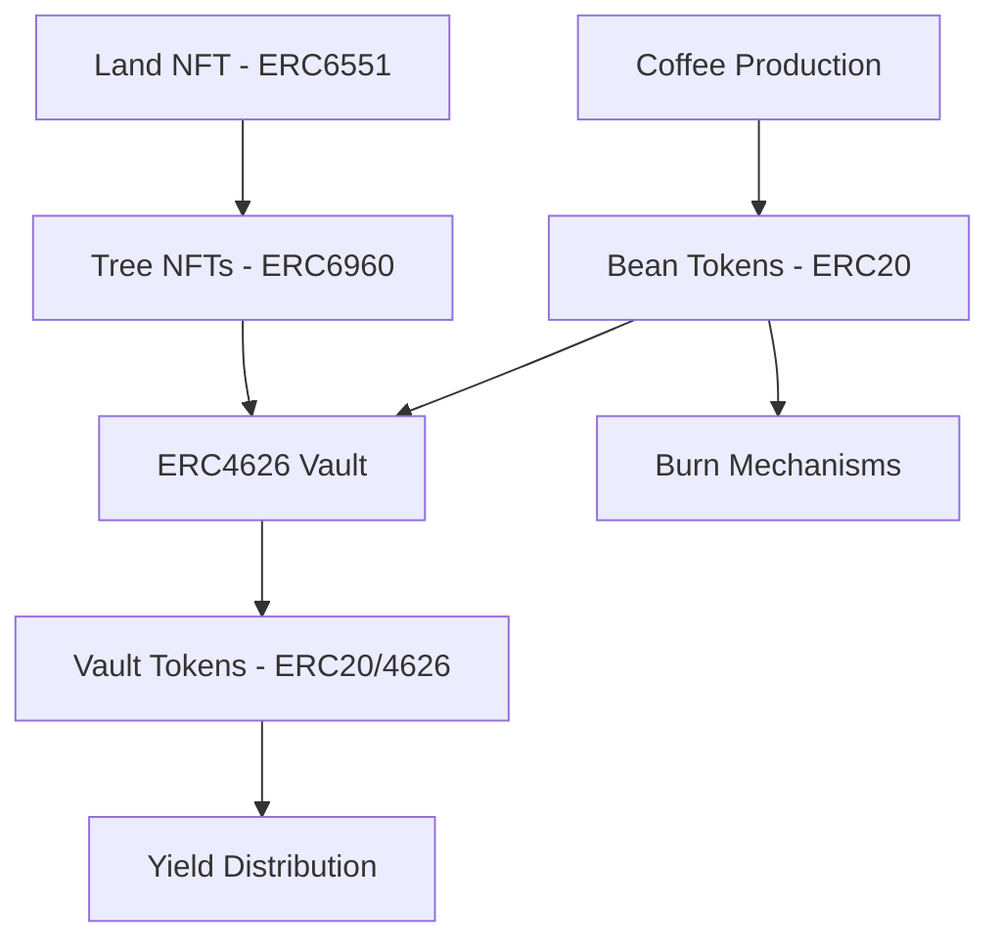
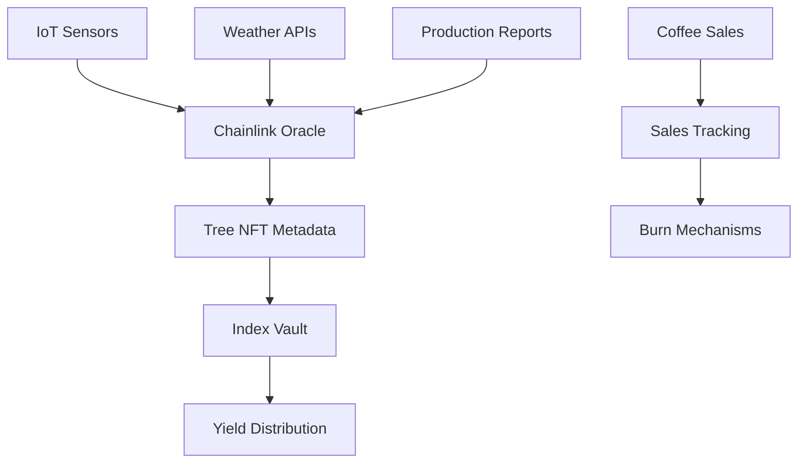
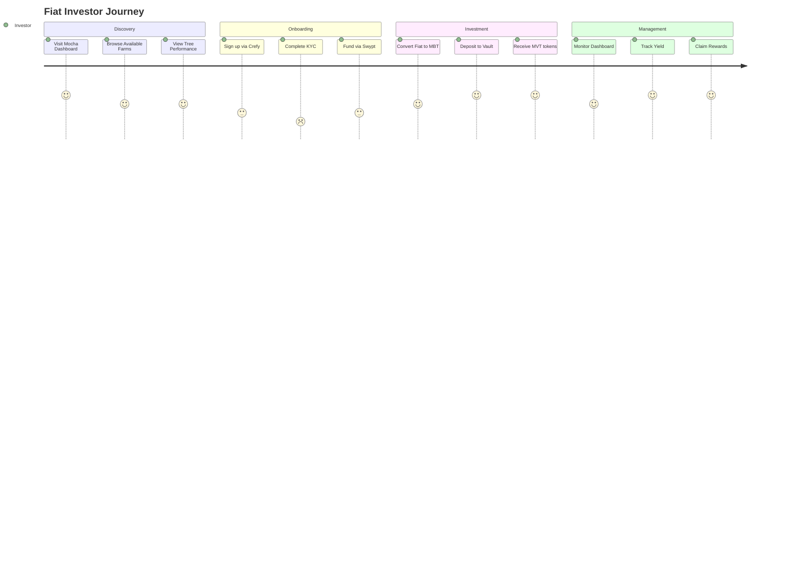
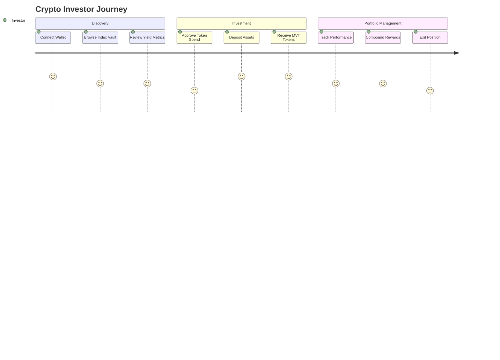
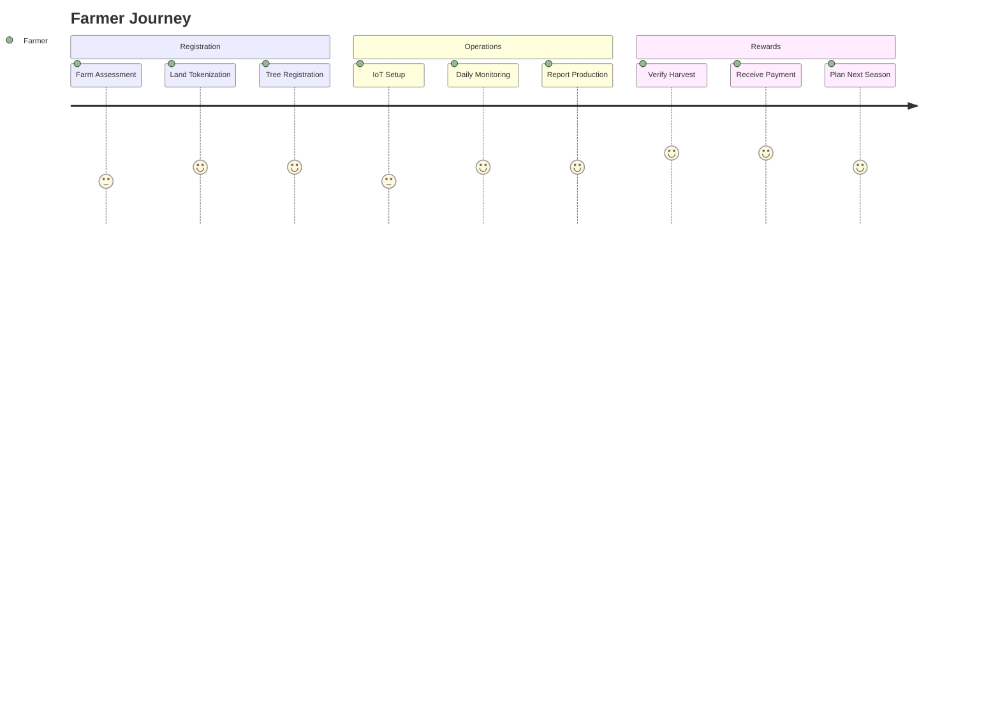
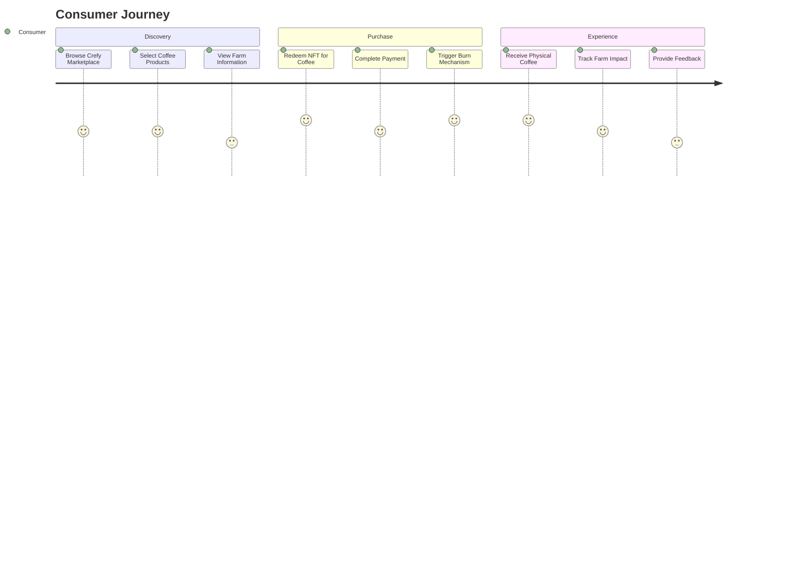
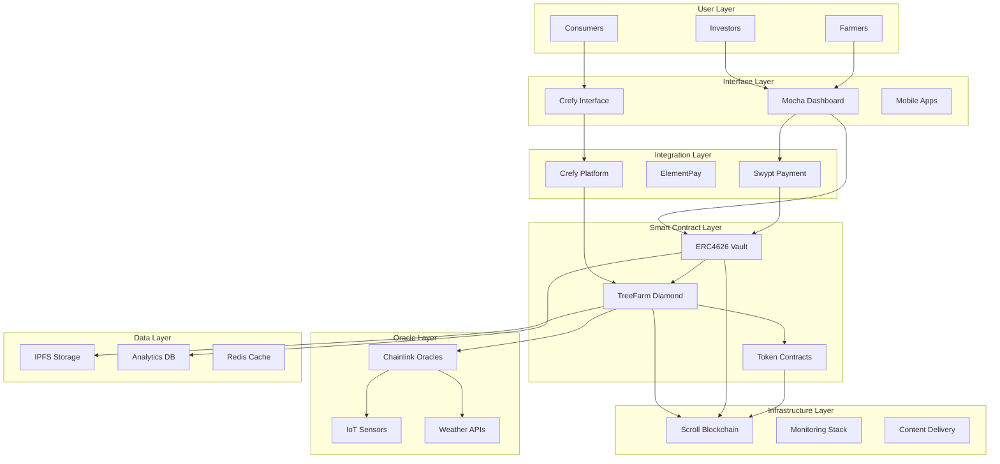

# Mocha Coffee Tokenization System - Complete System Architecture

## Executive Summary

The Mocha Coffee Tokenization System is a comprehensive blockchain-based platform that tokenizes coffee production assets and creates investment opportunities through innovative DeFi mechanisms. Built on Scroll blockchain with Zero-Knowledge proof capabilities, the system combines physical asset tokenization (land and trees) with financial instruments (ERC4626 vaults) to create a transparent, efficient, and scalable coffee investment ecosystem.

## Table of Contents

1. [System Overview](#system-overview)
2. [Token Architecture](#token-architecture)
3. [Core Components](#core-components)
4. [ERC4626 Vault System](#erc4626-vault-system)
5. [Data Flow Architecture](#data-flow-architecture)
6. [User Journey Mapping](#user-journey-mapping)
7. [Tokenomics Structure](#tokenomics-structure)
8. [Integration Layer](#integration-layer)
9. [Smart Contract Diamond Pattern](#smart-contract-diamond-pattern)
10. [Security and ZK Implementation](#security-and-zk-implementation)
11. [Deployment Architecture](#deployment-architecture)

## System Overview

### High-Level Architecture

The Mocha Coffee system operates as a multi-layered architecture connecting physical coffee production assets with digital financial instruments:

**Layer 1: Physical Asset Layer**
- Coffee farms and land parcels
- Individual coffee trees
- IoT sensors and monitoring equipment
- Production verification systems

**Layer 2: Tokenization Layer**
- Land NFTs (ERC6551) - Smart contract wallets representing farm parcels
- Tree NFTs (ERC6960) - Individual coffee tree tokens with enhanced metadata
- Production rights tokenization

**Layer 3: Financial Layer**
- ERC4626 vaults for investment pooling
- Index vault strategy for risk distribution
- Yield distribution mechanisms
- Staking and rewards systems

**Layer 4: Integration Layer**
- External data feeds (Chainlink oracles)
- Payment processors (Swypt, ElementPay)
- NFT redemption systems (Crefy)
- User authentication and wallets

**Layer 5: User Interface Layer**
- Investor dashboard
- Farm management interface
- Mobile applications
- Third-party integrations

## Token Architecture

### Primary Token Types

#### 1. Mocha Land Tokens (MLT) - ERC6551
```
Purpose: Represent ownership/operational control of coffee farm land
Features:
- Smart contract wallet capability
- Can own and manage tree NFTs
- Stores farm-level metadata and certifications
- Enables land-based governance and management
```

#### 2. Mocha Tree Tokens (MTT) - ERC6960
```
Purpose: Individual coffee tree production rights
Features:
- Enhanced metadata with dynamic updates
- IoT sensor integration for real-time data
- Yield tracking and prediction capabilities
- Individual tree health and production history
- Chainlink weather data integration
```

#### 3. Mocha Bean Tokens (MBT) - ERC20
```
Purpose: Reward and utility token representing actual coffee production
Features:
- Backed by verified coffee production
- Tradeable on exchanges
- Used for vault deposits and rewards
- Burn mechanisms tied to coffee sales
```

#### 4. Mocha Vault Tokens (MVT) - ERC20/ERC4626
```
Purpose: Index vault tokens representing diversified coffee investment
Features:
- ERC4626 compliant vault shares
- Represents claim on vault assets
- Yield-bearing tokens with time-based validity
- Redeemable for proportional vault rewards
```

### Token Relationships



## Core Components

### 1. Land Management System (ERC6551)

**Smart Contract Wallet Functionality:**
- Each land parcel is represented as an ERC6551 NFT
- Wallet can own and transfer tree NFTs
- Executes farm management transactions
- Stores operational permissions and certifications

**Key Features:**
- GPS boundary mapping
- Soil quality metrics
- Environmental certifications (organic, fair trade)
- Historical production data
- Farm manager assignments

### 2. Tree Management System (ERC6960)

**Enhanced Metadata Storage:**
- Dynamic metadata updates through oracle feeds
- IoT sensor integration for real-time monitoring
- Yield prediction algorithms
- Health status tracking

**Production Tracking:**
- Individual tree yield history
- Quality metrics (bean size, flavor profile)
- Harvest schedules and predictions
- Disease and pest monitoring

### 3. ERC4626 Vault System

**Index Vault Strategy:**
Instead of individual farm vaults, the system uses a single index vault that:
- Aggregates trees from multiple farms
- Provides diversified exposure to coffee production
- Simplifies investor experience
- Reduces risk through portfolio effects

**Vault Mechanics:**
```solidity
contract MochaIndexVault is ERC4626 {
    // Accepts deposits in: MBT, USDT, USDC, ETH
    // Issues: MVT (Mocha Vault Tokens)
    // Distributes: MBT rewards based on actual production
}
```

## ERC4626 Vault System

### Vault Structure and Operations

#### Deposit Assets
- **Primary**: MBT (Mocha Bean Tokens)
- **Secondary**: USDT, USDC, ETH (converted to MBT)
- **Conversion**: Through integrated DEX or direct purchase

#### Vault Token (MVT) Properties
- **Type**: ERC20/ERC4626 compliant
- **Function**: Yield-bearing investment token
- **Validity**: Time-based lease periods
- **Redemption**: Proportional to vault performance

#### Pricing Mechanism
Vault token pricing based on:
- Historical yield data from tokenized trees
- Current coffee market prices
- Seasonal production cycles
- Risk assessment factors

### Yield Distribution Model

#### Distribution Ratios
```
Coffee Production Revenue Distribution:
├── Farmers: 40%
├── Investors: 30%
├── Treasury: 30%
    ├── Operations: 15%
    ├── Development: 10%
    └── Burn Mechanisms: 5%
```

#### Yield Calculation Process
1. **Production Verification**: IoT sensors + manual audits verify harvest
2. **Quality Assessment**: Grading and quality metrics applied
3. **Revenue Calculation**: Market price × verified production
4. **Distribution Execution**: Smart contract distributes according to ratios

## Data Flow Architecture

### Real-Time Data Pipeline



### Data Sources and Integration

#### Primary Data Sources
1. **IoT Sensors**
   - Soil moisture and pH levels
   - Temperature and humidity
   - Tree health indicators
   - Pest and disease detection

2. **Chainlink Oracles**
   - Weather data feeds
   - Coffee market prices
   - Currency exchange rates
   - Production verification

3. **Manual Inputs**
   - Harvest reports
   - Quality assessments
   - Maintenance records
   - Farm management decisions

#### Data Processing Flow
```
Raw Data → Validation → Oracle Update → NFT Metadata → Vault Calculations → Distribution
```

## User Journey Mapping

### Investor Journey

#### Fiat Users (Onboarding through Crefy/Swypt)


#### Crypto Native Users


### Farmer Journey



### Coffee Consumer Journey



## Tokenomics Structure

### Token Supply and Distribution

#### MBT (Mocha Bean Token) Economics
```
Initial Supply: 10,000,000 MBT
Distribution:
├── Production Rewards: 60%
├── Investor Incentives: 20%
├── Team and Advisors: 10%
└── Treasury Reserve: 10%

Supply Mechanics:
├── Minting: Tied to verified coffee production
├── Burning: Through coffee sales and redemptions
└── Deflation: Net burn through consumer redemptions
```

#### Vault Token Lifecycle
```
Vault Token Lifecycle:
1. Deposit Period: Users deposit MBT/stablecoins
2. Lease Period: Fixed duration (6-24 months)
3. Yield Period: Continuous distribution based on production
4. Redemption: Token expires, final distribution occurs
```

### Economic Incentives and Game Theory

#### Stakeholder Alignment
- **Farmers**: Incentivized to maximize quality and yield
- **Investors**: Rewarded for long-term commitment
- **Consumers**: Benefit from transparency and quality assurance
- **Platform**: Sustainable revenue through transaction fees

#### Burn Mechanisms
1. **Direct Sales**: Coffee purchases burn equivalent MBT
2. **NFT Redemptions**: Physical coffee redemptions via Crefy
3. **Platform Fees**: Portion of fees allocated to burns
4. **Yield Redistribution**: Unclaimed yields contribute to burns

## Integration Layer

### External Integrations

#### Payment and Onboarding
```
Swypt Integration:
├── Fiat-to-crypto conversion
├── Multi-currency support
├── Compliance and KYC
└── Direct vault deposits

ElementPay Integration:
├── Alternative payment processing
├── Regional payment methods
├── Lower fees for specific regions
└── Mobile-first experience
```

#### NFT and Redemption Platform
```
Crefy Integration:
├── User authentication and wallet abstraction
├── NFT marketplace for coffee products
├── Physical redemption mechanisms
├── Burn event triggers
└── Coffee product inventory management
```

#### Oracle and Data Services
```
Chainlink Integration:
├── Weather data feeds
├── Coffee commodity prices
├── Production verification
├── Sales tracking
└── Currency exchange rates
```

### API Architecture

#### Core APIs
```
Farm Management API:
├── GET /farms - List all farms
├── GET /farms/{id}/trees - Get farm trees
├── POST /farms/{id}/production - Report production
└── GET /farms/{id}/analytics - Farm analytics

Vault API:
├── GET /vaults/index - Index vault information
├── POST /vaults/deposit - Process deposits
├── GET /vaults/performance - Performance metrics
└── POST /vaults/withdraw - Process withdrawals

Oracle API:
├── GET /oracles/weather - Weather data
├── GET /oracles/prices - Coffee prices
├── POST /oracles/production - Production data
└── GET /oracles/sales - Sales tracking
```

## Smart Contract Diamond Pattern

### Diamond Architecture Implementation

The system uses EIP-2535 Diamond Pattern for modularity and upgradeability:

```
TreeFarmDiamond (Main Contract)
├── DiamondCutFacet (Upgrade Management)
├── DiamondLoupeFacet (Introspection)
├── OwnershipFacet (Access Control)
├── FarmManagementFacet (Farm Operations)
├── TreeManagementFacet (Tree Operations)
├── VaultManagementFacet (ERC4626 Implementation)
├── YieldManagementFacet (Yield Distribution)
├── StakingFacet (Staking Mechanisms)
└── OracleFacet (Data Feed Management)
```

### Storage Architecture

```solidity
library LibAppStorage {
    struct AppStorage {
        // Farm Management
        mapping(uint256 => Farm) farms;
        mapping(uint256 => Tree) trees;
        
        // Vault Management
        VaultStorage vault;
        mapping(address => UserPosition) positions;
        
        // Yield Distribution
        mapping(uint256 => YieldEpoch) epochs;
        mapping(address => uint256) pendingRewards;
        
        // Oracle Integration
        mapping(bytes32 => OracleData) oracleFeeds;
        uint256 lastUpdateTimestamp;
    }
}
```

## Security and ZK Implementation

### Zero-Knowledge Implementation on Scroll

#### Privacy-Preserving Features
```
ZK Proof Applications:
├── Farm Production Verification
│   ├── Prove yield without revealing exact amounts
│   ├── Maintain competitive advantage
│   └── Verify quality metrics privately
├── Investor Privacy
│   ├── Private investment amounts
│   ├── Anonymous yield claiming
│   └── Confidential portfolio composition
└── Supply Chain Verification
    ├── Origin verification without location exposure
    ├── Quality attestations
    └── Certification proofs
```

#### Scroll L2 Benefits
- **Lower Gas Costs**: Reduced transaction fees for frequent updates
- **Faster Finality**: Quick confirmation for time-sensitive operations
- **ZK Security**: Inherited Ethereum security with privacy features
- **EVM Compatibility**: Seamless integration with existing tools

### Security Measures

#### Smart Contract Security
```
Security Layers:
├── Multi-signature Requirements
├── Time-locked Upgrades
├── Emergency Pause Mechanisms
├── Access Control (Role-based)
├── Reentrancy Protection
└── Oracle Manipulation Protection
```

#### Data Integrity
- **Oracle Redundancy**: Multiple data sources for critical metrics
- **Cryptographic Signatures**: Signed data from IoT devices
- **Audit Trails**: Immutable production and transaction history
- **Dispute Resolution**: Mechanism for challenging incorrect data

## Deployment Architecture

### Scroll Blockchain Deployment

#### Network Configuration
```
Scroll Mainnet Deployment:
├── Core Diamond Contract: TreeFarmDiamond
├── Token Contracts: MLT, MTT, MBT, MVT
├── Vault Implementation: MochaIndexVault
├── Oracle Contracts: ChainlinkOracle
└── Integration Contracts: Swypt, Crefy adapters
```

#### Infrastructure Requirements
```
Deployment Infrastructure:
├── Scroll RPC Endpoints
├── IPFS for Metadata Storage
├── Chainlink Oracle Subscriptions
├── Multi-signature Wallet Setup
└── Monitoring and Analytics Stack
```

### Production Environment

#### Scaling Considerations
- **Horizontal Scaling**: Multiple farm integration capability
- **Load Balancing**: API gateway for high-frequency requests
- **Caching Layer**: Redis for frequently accessed data
- **CDN Integration**: Global content delivery for dashboards

#### Monitoring and Maintenance
```
Monitoring Stack:
├── Smart Contract Event Monitoring
├── Oracle Data Feed Validation
├── Transaction Success Rate Tracking
├── Gas Optimization Monitoring
└── User Experience Analytics
```

## Component Interaction Diagram



## Conclusion

The Mocha Coffee Tokenization System represents a comprehensive solution for bridging physical coffee production with digital financial instruments. Through innovative use of ERC4626 vaults, ERC6551 land tokens, and ERC6960 tree tokens, the system creates a transparent, efficient, and scalable investment platform.

Key advantages:
- **Risk Distribution**: Index vault approach spreads risk across multiple farms
- **Transparency**: Blockchain-based production tracking and yield distribution
- **Accessibility**: Multiple onboarding paths for different user types
- **Scalability**: Diamond pattern enables continuous feature development
- **Security**: ZK proofs on Scroll provide privacy and security
- **Real-world Integration**: IoT and oracle systems ensure data accuracy

The system is designed to scale from the initial deployment to a global coffee investment platform, maintaining transparency, efficiency, and participant alignment throughout its growth.

