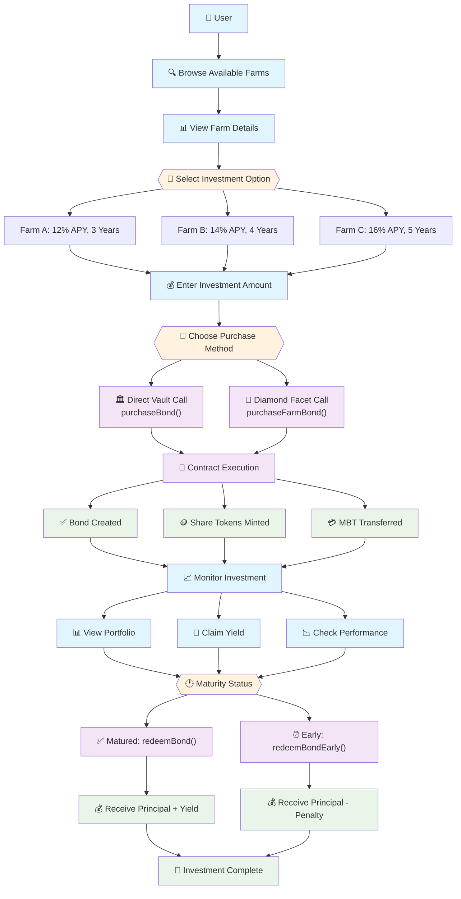
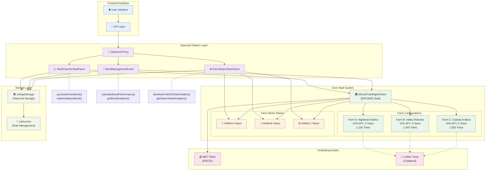

# 🏛️ Multi-Tranche Vault System - Complete Documentation

## 📊 **System Overview**

The Mocha Coffee Multi-Tranche Vault System is a comprehensive **ERC4626-compliant** financial platform that transforms individual farm funding into **asset-backed bonds**. Each farm operates as an independent tranche with its own share token, creating a structured finance approach where coffee trees serve as direct collateral.

### **Core Architecture**
```
┌─────────────────────────────────────────────────────────────┐
│                    MTTR VAULT MANAGER                      │
│                   (ERC4626 Standard)                       │
│                                                             │
│  ┌─────────────────┐  ┌─────────────────┐  ┌──────────────┐ │
│  │   FARM A        │  │   FARM B        │  │   FARM C     │ │
│  │   TRANCHE       │  │   TRANCHE       │  │   TRANCHE    │ │
│  │                 │  │                 │  │              │ │
│  │ FARM-A Tokens   │  │ FARM-B Tokens   │  │ FARM-C Token │ │
│  │ 12% APY         │  │ 14% APY         │  │ 16% APY      │ │
│  │ 3 Years         │  │ 4 Years         │  │ 5 Years      │ │
│  │ 1,100 Trees     │  │ 1,400 Trees     │  │ 1,000 Trees  │ │
│  └─────────────────┘  └─────────────────┘  └──────────────┘ │
└─────────────────────────────────────────────────────────────┘
```

## 🏗️ **Implemented Vault Features**

### **1. Core ERC4626 Vault Manager** (`MochaTreeRightsToken.sol`)

#### **✅ Multi-Tranche Management**
- **Farm Registration**: Add farms as independent tranches
- **Share Token Deployment**: Automatic ERC20 token creation per farm
- **Bond Configuration**: Customizable APY, maturity, and investment limits per farm
- **Collateral Tracking**: Real-time tree-based collateral management

#### **✅ Asset-Backed Bond System**
- **Tree Collateralization**: Each tree valued at 800 MBT as bond collateral
- **Bond Purchase/Redemption**: Full lifecycle management
- **Maturity Handling**: Automatic bond settlement at maturity
- **Early Redemption**: Early exit with penalty mechanism

#### **✅ Yield Distribution Engine**
- **Farm-Specific Distribution**: Independent yield per farm
- **Automatic Calculations**: Per-share yield distribution
- **Yield Tracking**: Complete historical yield records
- **Real-time Updates**: Dynamic yield allocation

### **2. Farm Share Token System** (`FarmShareToken.sol`)

#### **✅ Independent ERC20 Tokens**
- **Per-Farm Tokens**: Separate token contract for each farm (FARM-A, FARM-B, etc.)
- **Yield Integration**: Built-in yield tracking and distribution
- **Transfer Hooks**: Automatic yield updates on token transfers
- **Claim System**: Users can claim accumulated yield anytime

#### **✅ Security & Governance**
- **Access Control**: Role-based permissions for minting/burning
- **Pausable Operations**: Emergency pause capabilities
- **Yield Protection**: Pending yield preservation during transfers

### **3. Diamond Pattern Integration** (`MultiTrancheVaultFacet.sol`)

#### **✅ Seamless Integration**
- **Vault Initialization**: Set up vault through Diamond architecture
- **Farm Management**: Register farms and trees through Diamond
- **Bond Operations**: Purchase and redeem bonds via Diamond functions
- **Yield Processing**: Distribute yield through Diamond coordination

### **4. Advanced Bond Management** (`BondManagementFacet.sol`)

#### **✅ Lifecycle Management**
- **Bond Creation**: Create new bond issuances for farms
- **Maturity Processing**: Handle bond maturity and settlement
- **Performance Analytics**: Calculate yield performance and risk metrics
- **Rollover System**: Bond renewal and farm switching options

#### **✅ Risk Management**
- **Collateral Monitoring**: Real-time coverage ratio tracking
- **Liquidation Triggers**: Automatic liquidation for undercollateralized farms
- **Risk Scoring**: Dynamic farm risk assessment
- **Emergency Controls**: Circuit breakers for high-risk situations

### **5. Enhanced Share Token Management** (`FarmShareTokenFacet.sol`)

#### **✅ Token Operations**
- **Dynamic Deployment**: Deploy new share tokens for farms
- **Batch Operations**: Efficient multi-farm yield distribution
- **Analytics Dashboard**: Comprehensive farm and user metrics
- **Emergency Controls**: Pause, mint, burn capabilities

## 🚀 **Complete User Journey: Bond Purchase Process**

### **Journey Overview**
```
Discovery → Selection → Investment → Monitoring → Redemption

   👤 User          📊 Frontend        🏛️ Vault        📜 Contracts
     │                  │                │               │
     │ 1. Browse Farms   │                │               │
     ├─────────────────▶│                │               │
     │                  │ 2. Fetch Data  │               │
     │                  ├───────────────▶│               │
     │                  │                │ 3. Query      │
     │                  │                ├──────────────▶│
     │ 4. Select Farm    │                │               │
     ├─────────────────▶│                │               │
     │ 5. Purchase Bond  │                │               │
     ├─────────────────▶│ 6. Execute Tx  │               │
     │                  ├───────────────▶│ 7. Process    │
     │                  │                ├──────────────▶│
```

### **Step-by-Step Journey**

#### **Phase 1: Farm Discovery & Selection**

**1. Browse Available Farms**
```javascript
// Frontend calls to get all farm options
const farms = await vaultContract.getAllFarms();
// Returns: Array of farm configurations with APY, maturity, risk levels
```

**Entry Point**: `getFarmConfig(farmId)` in `MochaTreeRightsToken.sol`
```solidity
struct FarmConfig {
    string name;                    // "Highland Arabica Farm"
    uint256 treeCount;              // 1,100 trees
    uint256 targetAPY;              // 1200 (12% APY)
    uint256 bondValue;              // 880,000 MBT total
    uint256 minInvestment;          // 100 MBT minimum
    uint256 maxInvestment;          // 50,000 MBT maximum
    address shareTokenAddress;      // FARM-A token address
    bool active;                    // Accepting investments
    uint256 maturityTimestamp;      // Bond maturity date
}
```

**2. Analyze Farm Details**
```javascript
// Get comprehensive farm analytics
const farmAnalytics = await getFarmAnalytics(farmId);
const collateralInfo = await vault.getCollateralInfo(farmId);
const yieldData = await vault.getYieldDistribution(farmId);
```

#### **Phase 2: Investment Execution**

**3. Bond Purchase Process**

**Option A: Direct Vault Interaction**
```solidity
// User calls MTTR vault directly
function purchaseBond(uint256 farmId, uint256 mbtAmount) 
    external returns (uint256 bondId)
```

**Process Flow**:
1. **Validation**: Check farm status, investment limits, maturity
2. **MBT Transfer**: Transfer MBT tokens from user to vault
3. **Share Token Minting**: Mint farm-specific share tokens to user
4. **Bond Creation**: Create bond position record
5. **Event Emission**: Emit BondPurchased event

**Option B: Diamond Pattern Integration**
```solidity
// User calls Diamond facet
function purchaseFarmBond(uint256 farmId, uint256 mbtAmount) 
    external returns (uint256 bondId)
```

**Process Flow**:
1. **Diamond Entry**: Call through `MultiTrancheVaultFacet`
2. **Token Handling**: Transfer MBT to Diamond, approve vault
3. **Vault Execution**: Diamond calls vault `purchaseBond`
4. **Storage Update**: Update Diamond storage for tracking
5. **Event Coordination**: Emit events through Diamond

#### **Phase 3: Investment Management**

**4. Monitor Investment Performance**

**Portfolio Tracking**:
```solidity
// Get user's bond position
function getBondPosition(address investor, uint256 bondId) 
    external view returns (BondPosition memory)

// Get farm share token balance
FarmShareToken farmToken = FarmShareToken(farm.shareTokenAddress);
uint256 shareBalance = farmToken.balanceOf(user);
uint256 pendingYield = farmToken.getPendingYield(user);
```

**5. Yield Claims**
```solidity
// Claim accumulated yield from farm share tokens
FarmShareToken farmToken = FarmShareToken(shareTokenAddress);
uint256 yieldAmount = farmToken.claimYield();
```

#### **Phase 4: Bond Redemption**

**6. Bond Maturity & Redemption**

**Mature Bond Redemption**:
```solidity
function redeemBond(uint256 bondId) external returns (uint256 redemptionAmount)
```

**Process Flow**:
1. **Maturity Check**: Verify bond has reached maturity
2. **Yield Calculation**: Calculate total yield earned
3. **Share Token Burn**: Burn user's farm share tokens
4. **Redemption Transfer**: Transfer principal + yield to user
5. **Position Update**: Mark bond as redeemed

**Early Redemption (with penalty)**:
```solidity
function redeemBondEarly(uint256 bondId) external returns (uint256 redemptionAmount)
```

**Process Flow**:
1. **Early Check**: Verify bond hasn't matured yet
2. **Penalty Calculation**: Apply 5% early redemption penalty
3. **Penalty Distribution**: Add penalty to farm yield pool
4. **Reduced Payout**: Transfer principal minus penalty

## 🔗 **Key Contract Entry Points**

### **Primary User Interfaces**

#### **1. MTTR Vault Contract** (`MochaTreeRightsToken.sol`)
```solidity
// Main vault operations
function purchaseBond(uint256 farmId, uint256 mbtAmount) external returns (uint256)
function redeemBond(uint256 bondId) external returns (uint256)
function redeemBondEarly(uint256 bondId) external returns (uint256)

// Information queries
function getFarmConfig(uint256 farmId) external view returns (FarmConfig memory)
function getBondPosition(address investor, uint256 bondId) external view returns (BondPosition memory)
function getCollateralInfo(uint256 farmId) external view returns (CollateralInfo memory)
```

#### **2. Farm Share Tokens** (`FarmShareToken.sol`)
```solidity
// Yield management
function claimYield() external returns (uint256)
function getPendingYield(address user) external view returns (uint256)

// Token information
function getTokenInfo() external view returns (...)
function getUserPosition(address user) external view returns (...)
```

#### **3. Diamond Facet Interface** (`MultiTrancheVaultFacet.sol`)
```solidity
// Vault operations through Diamond
function purchaseFarmBond(uint256 farmId, uint256 mbtAmount) external returns (uint256)
function redeemMatureBond(uint256 bondId) external returns (uint256)
function distributeFarmYield(uint256 farmId, uint256 yieldAmount) external

// Farm management
function addFarmToVault(string memory name, address farmOwner, uint256 treeCount, uint256 targetAPY, uint256 maturityPeriod) external returns (uint256)
```

### **Administrative Interfaces**

#### **4. Bond Management** (`BondManagementFacet.sol`)
```solidity
// Advanced bond operations
function createBondIssuance(uint256 farmId, uint256 bondAmount, uint256 maturityMonths, uint256 targetAPY, uint256 collateralRatio) external
function processBondMaturity(uint256 farmId) external
function updateCollateralValuation(uint256 farmId, uint256 newValuation) external

// Analytics and monitoring
function calculateBondPerformance(uint256 farmId) external view returns (...)
function getBondAnalytics(uint256 farmId) external view returns (BondAnalytics memory)
```

#### **5. Share Token Management** (`FarmShareTokenFacet.sol`)
```solidity
// Token deployment and management
function deployFarmShareToken(uint256 farmId, string memory tokenName, string memory tokenSymbol) external returns (address)
function distributeYieldToShareHolders(uint256 farmId, uint256 yieldAmount) external

// Analytics
function getShareTokenAnalytics(uint256 farmId) external view returns (ShareTokenAnalytics memory)
function getUserSharePosition(uint256 farmId, address user) external view returns (UserSharePosition memory)
```

## 💰 **Financial Features**

### **Investment Parameters**
```
Farm A (Highland Arabica):
├── Target APY: 12%
├── Maturity: 3 years
├── Collateral: 1,100 trees × 800 MBT = 880,000 MBT
├── Min Investment: 100 MBT
├── Max Investment: 50,000 MBT
└── Share Token: FARM-A

Farm B (Valley Robusta):
├── Target APY: 14%
├── Maturity: 4 years
├── Collateral: 1,400 trees × 800 MBT = 1,120,000 MBT
├── Min Investment: 100 MBT
├── Max Investment: 50,000 MBT
└── Share Token: FARM-B
```

### **Risk Management**
- **Collateral Monitoring**: Real-time tree valuation tracking
- **Coverage Ratios**: Minimum 80% collateralization required
- **Liquidation Triggers**: Automatic liquidation at 64% coverage
- **Performance Analytics**: Dynamic risk scoring and yield tracking

### **Yield Distribution**
- **Farm-Specific**: Independent yield calculation per farm
- **Automatic Distribution**: Per-share yield allocation
- **Compound Potential**: Reinvestment options available
- **Historical Tracking**: Complete yield history maintenance

## 🎯 **Production Readiness**

### **✅ Fully Implemented Systems**
- ✅ **ERC4626 Multi-Tranche Vault**: Complete vault infrastructure
- ✅ **Asset-Backed Bonds**: Tree-collateralized bond system
- ✅ **Farm Share Tokens**: Independent ERC20 tokens per farm
- ✅ **Diamond Integration**: Seamless modular architecture integration
- ✅ **Risk Management**: Collateral monitoring and liquidation systems
- ✅ **Yield Distribution**: Automatic farm-specific yield processing
- ✅ **Performance Analytics**: Real-time bond and farm metrics
- ✅ **Emergency Controls**: Comprehensive security and governance

# Images(Mermaid):

## Investor Journey:



## System Architecture:


